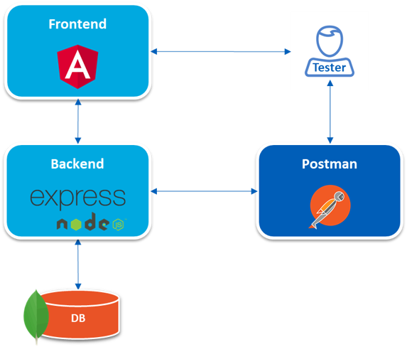
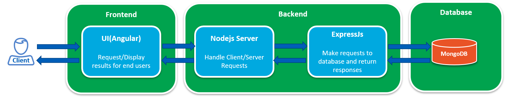

# MEAN-Website-Frontend
Frontend application using Angular4

Backend application is written in MEAN-Website-Backend repo.

# Architecture


Above picture describes how the applications are positioned. This is high level flow.

Testing is done manually. The tests can be automated using Robot framework's requests and ui testing libraries.



This picture describes the sequence of the calls, this is low level design for this complete application, this repo only consist of frontend side.


# Lets setup the environment
#### Setup Angular Project-
- First run ```npm install -g @angular/cli``` to install the Official Angular CLI globally
- Now run ```ng new todoapp-angular --style=scss``` to generate an Angular app.
- ````cd todoapp-angular```` and then ````npm install````
- Now run ````ng serve```` and Go to http://localhost:4200 to see the generated app.

#### Add Bootstrap and Font-awesome 
Run ````npm install --save bootstrap@4.0.0-beta @ng-bootstrap/ng-bootstrap font-awesome````

# Reference
https://medium.com/@nomanbinhussein/mean-app-tutorial-with-angular-4-part-2-4250522c845